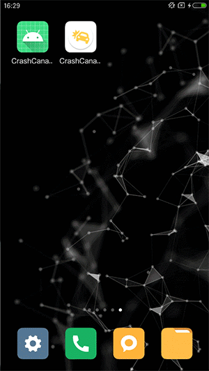
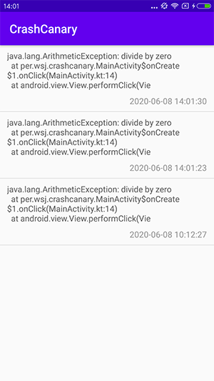
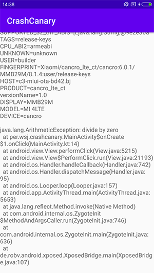

# Android开发必备神器-CrashCanary


## 前言

安卓开发中，你是否遇到过如下困扰：

**场景一**

开发好一个功能后提交给测试小姑娘，测试中说“app停止运行”，然后你拿着他的测试机连到自己电脑上，重复操作一下，看看log找崩溃的原因。

如果是必现的bug还好，遇到偶现的bug的蛋疼了。

**场景二**

可能你的项目中接入了`UncaughtExceptionHandler`，崩溃日志会以文件的方式保存在sd卡，但是有的设备不支持直接查看这些文件，此时还得连上电脑找到这个文件。

**场景三**

可能你的项目中使用了三方统计，可以统计出app崩溃的日志，但是三方统计的数据一般不是及时的，可能要等一段时间数据才能同步。


## 推荐一个小工具

扯了这么多，就是少一个崩溃日志记录查看工具，那么接下来推荐一个安卓开发必备的工具。

`CrashCanary`是一个无侵入的安卓崩溃日志记录库，对你的代码没有任务侵入性，无需申请权限，只需要添加依赖，即可在程序崩溃时记录崩溃日志并可查看所有日志。

效果如下：



github地址

https://github.com/wsj1024/CrashCanary


**快速接入**

```groovy
allprojects {
	repositories {
		...
		maven { url 'https://jitpack.io' }
	}
}
dependencies {
	debugImplementation  'com.github.wsj1024:CrashCanary:1.0.0'
}
```
是的，这样就接入了，你不需要添加任何代码，真正的无侵入。

不瞒你说，这里就是参考了`LeakCanary2`。

和`LeakCanary2`一样，程序安装后会多出来一个图标为`CrashCanary`的入口，名字和你的应用名相同（感觉同名不同图标更加人性化，因为如果你几个app都接入了`LeakCanary`时，应用列表就会有好几个名为Leaks的app入口，此时你可能就不知道哪个是哪个了）。

一旦你的app崩溃了，可以从这个同名的入口进入查看日志，或者通知栏的通知进入。如下：



点击日志item进入日志详情，详情中记录了崩溃的详细日志，同时还记录了设备的版本、型号、cpu以及软件版本等信息。



## 原理及涉及知识点

**1，UncaughtExceptionHandler**

`UncaughtExceptionHandler`可以帮我们捕获我们代码中未捕获而导致崩溃的异常，源码如下：

```java
public interface UncaughtExceptionHandler {
   /**
    * Method invoked when the given thread terminates due to the
    * given uncaught exception.
    * <p>Any exception thrown by this method will be ignored by the
    * Java Virtual Machine.
    * @param t the thread
    * @param e the exception
    */
   void uncaughtException(Thread t, Throwable e);
}
```

它只是一个接口，系统的`LoggingHandler`就是它的实现类。


**2，自定义UncaughtExceptionHandler**

`Thread`类提供了设置`UncaughtExceptionHandler`的方法

```java
/**
  * Set the default handler invoked when a thread abruptly terminates
  * due to an uncaught exception, and no other handler has been defined
  * for that thread.
*/

public static void setDefaultUncaughtExceptionHandler(UncaughtExceptionHandler eh) {
    defaultUncaughtExceptionHandler = eh;
}
```

因此我们只需要实现`UncaughtExceptionHandler`，并调用当前线程的`setDefaultUncaughtExceptionHandler`方法即可。

主要代码如下：

```java
public class CrashHandler implements UncaughtExceptionHandler {

    public static final String TAG = "CrashHandler";
    // CrashHandler实例
    private static CrashHandler instance
    // 系统默认的UncaughtException处理类
    private UncaughtExceptionHandler mDefaultHandler;
    // 程序的Context对象
    private Context mContext;

    /**
     * 保证只有一个CrashHandler实例
     */
    private CrashHandler() {
    }

    /**
     * 获取CrashHandler实例 ,单例模式
     */
    public static CrashHandler getInstance() {
        if (instance == null) {
            instance = new CrashHandler();
        }
        return instance;
    }

    /**
     * 初始化
     */
    public void init(Context context) {
        mContext = context;
        // 获取系统默认的UncaughtException处理器
        mDefaultHandler = Thread.getDefaultUncaughtExceptionHandler();
        // 设置该CrashHandler为程序的默认处理器
        Thread.setDefaultUncaughtExceptionHandler(this);
    }

    /**
     * 当UncaughtException发生时会转入该函数来处理
     */
    @Override
    public void uncaughtException(Thread thread, Throwable ex) {
        if (!handleException(ex) && mDefaultHandler != null) {
            //如果用户没有处理则让系统默认的异常处理器来处理
            mDefaultHandler.uncaughtException(thread, ex);
        } else {
            try {
                Thread.sleep(2000);
            } catch (InterruptedException e) {
                Log.e(TAG, "error : ", e);
            }
            // 退出程序
            System.exit(0);
        }
    }

    /**
     * 自定义错误处理,收集错误信息 发送错误报告等操作均在此完成.
     *
     * @param ex
     * @return true:如果处理了该异常信息;否则返回false.
     */
    private boolean handleException(Throwable ex) {
        // todo 记录日志
        return true;
    }
}
```

主要逻辑为：首先获取线程默认的`UncaughtExceptionHandler`，当发生异常时在`uncaughtException()`方法中首先执行自己的处理异常的逻辑，如果自己未能处理，则调用系统默认的来处理，最后退出程序。


**3，记录日志**

​		1，首先获取日志详情

日志存在于`Throwable`中，从其中获取详情需要使用`Writer`及`PrintWriter`来获取。

```java
Writer writer = new StringWriter();
PrintWriter printWriter = new PrintWriter(writer);
ex.printStackTrace(printWriter);
Throwable cause = ex.getCause();
while (cause != null) {
	cause.printStackTrace(printWriter);
	cause = cause.getCause();
}
printWriter.close();
String result = writer.toString();
```

​		2，其次，要获取系统信息及apk信息。

```java
// 获取app版本信息
PackageManager pm = ctx.getPackageManager();
PackageInfo pi = pm.getPackageInfo(ctx.getPackageName(), PackageManager.GET_ACTIVITIES);
String versionName = pi.versionName == null ? "null" : pi.versionName;
String versionCode = pi.versionCode + "";
```

```java
// 获取设备型号等信息
Field[] fields = Build.class.getDeclaredFields();
for (Field field : fields) {
    field.setAccessible(true);
    Log.d(TAG, field.getName() + " : " + field.get(null));
}
```

​		3，保存数据

可以使用SQLite数据库来保存数据，这样既不需要申请读sd卡权限，又可以方便程序读取。


**4，日志读取**

日志是在一个和app同名的入口中查看的，那么如何生成这个入口呢？

首先要明确这不是另一个app，他们是一个app，不信你卸载这个同名app试试，你的app也会被卸载掉。

它其实就是一个配置了`Launcher`的`Activity`，如下：

```xml
<activity
    android:name=".ui.CrashViewerActivity"
    android:icon="@mipmap/ic_crash_icon"
    android:taskAffinity="wsj.crash.lib">
    <intent-filter>
        <action android:name="android.intent.action.MAIN" />
        <category android:name="android.intent.category.LAUNCHER" />
    </intent-filter>
</activity>
```

需要注意的是该activity需要配置一个`taskAffinity`，不然这个activity会和你的应用在同一个栈中，影响正常的返回栈逻辑。


**5，无侵入**

如何做到无侵入呢？和`LeakCanary2`一样，使用`ContentProvider`，在其`onCreate()`方法中初始化我们的`CrashHandler`即可。


## 总结

目前业界已经存在不少更好的功能更全的工具。本文详细讲解了无侵入式的android崩溃日志记录流程，对新手提供一些思路，希望大佬们不要喷，根据自己的需要找到一款适合自己的工具才是最重要的。

最后附上地址：https://github.com/wsj1024/CrashCanary